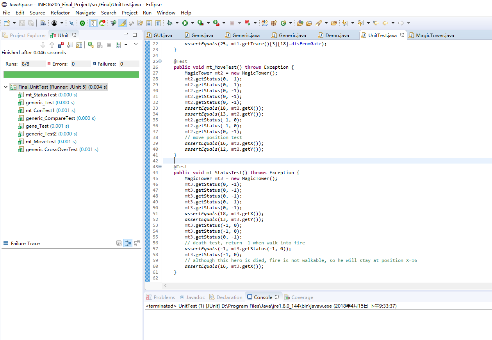
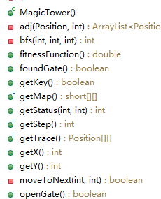
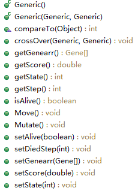

## INFO6205_519
- Boyang Wei  	001883667
- Changsi Liu		001831955
## Problem Description:  
Magic Tower (http://www.flashgames247.com/misc-game/magic-tower.html), is an interesting flash game with lots of strategy decisions and calculation. 
Player control a hero moving in the magic tower, open doors, kill monsters, solve puzzles and finally save the princess.  
In our genetic algorithm project, we simplified this game, only leave the maze part with a key and door puzzle. 
In detail, our algorithm will try to find a key in the maze first, 
then use this key to open a gate and finally find the way to the next level of the tower.   

## 1.	Genetic code
- Genetic class is one individual hero. Every hero has 150 genes so every hero can move at most 150 steps in the maze. 
Genes in Genetic(hero) class can be created by a random generator or generating from parents. 
- Mutation method is also supported, the rate is 0.001, this means every gene have a 0.1% possibility to mutate. Approximately, the possibility of mutation happened is 86% in one individual hero.

## 2.	Gene expression
- Gene in our algorithm is the direction of moving, coded by int 0,1,2,3 (type), means move DOWN, LEFT, UP, RIGHT (gene expression) in the maze.  

|Genotype|phenotype |
|---- | --- |
|0 | DOWN |
|1 | LEFT |
|2 | UP |
|3 | RIGHT |

## 3.	Fitness function
- The fitness function is in our MagicTower class. Generic (hero) class does not know whether he has a key, but a status and score returned from MagicTower class.
- We use Breadth-first search to find the shortest path and distance of every position in the maze to “end”, “key” and “gate” positions. 
- The more achievements the hero get, for example, finding a key worth 1000 point, the more score he will get. 

## 4.	A Sort Function 
- Yes! We are using a priority queue.
```
static PriorityBlockingQueue<Generic> pq = new PriorityBlockingQueue<>();
```
- PriorityBlockingQueue, because we want to do the multithreading part. We override the compareTo() method in Generic so it will be sorted by scores return from fitness function. 

## 5.	Evolution Mechanism
- To generate next generation from parents, we select 5 individuals with highest scores in the recent generation as parents. For each of these parents, they will be father or mother by turns. Crossover() method will be called many times (we choice 4 here) to create enough offspring for next generation.
- When a gene from father and mother are the same, their children will get this gene on this location. 
- If not, we use a formula below to calculate where the gene comes from:
```
flag < (father.getScore() / (father.getScore() + mother.getScore())
```
- “Flag” here is a random “double” from 0 to 1. Parent with higher score will have higher possibilities to give their gene to children.
### 5.1 Maze is dangerous and may cause death. 
- Our algorithm does some punishments: Generic(hero) will lose all his gene after the died step even if this hero has the highest score. Lost genes cannot be inherited to children (because the last generation is already “died”) and will use some random gene instead.
```
if(i < father.diedStep) {
} else {
  this.genearr[i] = new Gene();
}
```
## 6. Logging Function
- We have a doLog() method to write logs. 
```
doLog(Generic generic, String code)
```
- We use generation number as file name and create .txt files in /history/ folder. Because generation is huge with bad luck, we decide to run doLog() method when individuals in the current generation get a higher score than previous.

## 7. Unit Tests
- 

## 8.	Parallel Computation Mechanism
- We are using 2 threads —— run 2 colonies at the same time. The population of each colony is 100. 
- Then merge these 2 colonies by adding all the populations into the priority queue, poll the 5 highest as parents. Finally do .clear() to empty the priority queue.

## 9. Conclusion 
- Finally they made it. They passed the maze and reached a bright new world. It is how life goes. As long as we hold on to it, finally we get our rewards. By the way, never make a same mistake happen twice(as our algorithm goes). 

## Class Methods
- 
- 
